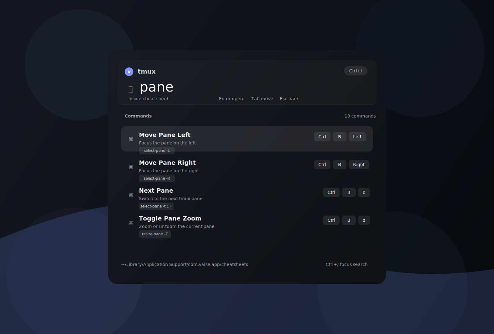

# Vaise

Vaise is a keyboard-first desktop launcher for shortcut cheat sheets, built with Tauri 2, React, TypeScript, and Rust.

It behaves like a small command palette that stays out of the dock/taskbar, opens on a global shortcut, lets you fuzzy-search cheat sheets, then drill into individual commands and copy them to the clipboard.

## How to Use



1. Launch Vaise.
2. Press `Ctrl+Cmd+K` to show or hide the launcher.
3. Type to search across cheat sheet names, tags, entry names, entry actions, aliases, and command text.
4. Press `Enter` on a cheat sheet to open it.
5. Type again to search entries within that sheet.
6. Press `Enter` on an entry to copy its command text to the clipboard.

Keyboard controls inside the launcher:

- `ArrowDown`, `Tab`, or `Ctrl+N` moves selection down
- `ArrowUp`, `Shift+Tab`, or `Ctrl+P` moves selection up
- `Enter` opens a cheat sheet or copies an entry
- `Backspace` on an empty entry query returns to the sheet list
- `Escape` clears the current query or exits the selected sheet
- `Ctrl+/` focuses and selects the search input

## What It Does

- Opens and hides from a global shortcut: `Ctrl+Cmd+K`
- Runs as an accessory-style desktop app with a tray icon
- Uses a two-step search flow between cheat sheets and their entries
- Copies the selected command or command sequence to the clipboard on `Enter`
- Seeds a user cheat sheet directory with default JSON files on first launch
- Hides automatically when the window loses focus

## Current App Behavior

The current Tauri window is configured as:

- transparent
- borderless
- always on top
- centered
- hidden by default
- skipped from the taskbar

On macOS, the launcher is additionally configured to behave more like a utility palette:

- accessory activation policy
- visible across spaces
- hidden on deactivate
- raised to a status-window-level style

## Tech Stack

- Tauri 2
- Rust
- React 18
- TypeScript
- Vite 5

## Project Structure

```text
.
├── src/                 # React frontend
├── src/lib/             # Tauri bridge, search, shared types
├── src-tauri/           # Rust app, Tauri config, icons
├── package.json         # frontend and Tauri scripts
└── README.md
```

## Requirements

You need the usual Tauri prerequisites for your platform:

- Node.js and npm
- Rust toolchain
- platform-native dependencies required by Tauri

On macOS, this repo is already configured to use `macOSPrivateApi` and tray/window features.

## Install

```bash
npm install
```

## Development

Start the Tauri app in development mode:

```bash
npm run tauri:dev
```

Useful scripts:

- `npm run dev` starts the Vite frontend on port `1420`
- `npm run build` runs TypeScript compilation and builds the frontend bundle
- `npm run preview` previews the built frontend
- `npm run tauri:dev` runs the full desktop app
- `npm run tauri:build` builds desktop bundles/installers

Vite is configured with:

- port `1420`
- `strictPort: true`
- `clearScreen: false`

## Build

Create production bundles:

```bash
npm run tauri:build
```

The Tauri bundle config currently targets `all` and uses generated icons from:

- [`src-tauri/icons/32x32.png`](/Users/brainrepo/project/Vaise/src-tauri/icons/32x32.png)
- [`src-tauri/icons/128x128.png`](/Users/brainrepo/project/Vaise/src-tauri/icons/128x128.png)
- [`src-tauri/icons/128x128@2x.png`](/Users/brainrepo/project/Vaise/src-tauri/icons/128x128@2x.png)
- [`src-tauri/icons/icon.icns`](/Users/brainrepo/project/Vaise/src-tauri/icons/icon.icns)
- [`src-tauri/icons/icon.ico`](/Users/brainrepo/project/Vaise/src-tauri/icons/icon.ico)

## Cheat Sheet Storage

Vaise stores cheat sheets in the app data directory under:

`<app data dir>/cheatsheets`

In the frontend fallback state, the expected macOS path is shown as:

`~/Library/Application Support/com.vaise.app/cheatsheets`

On first launch, Vaise:

- creates the `cheatsheets` directory if it does not exist
- checks whether any `.json` files already exist
- writes default cheat sheets only when the directory is empty

Files are loaded from that directory at runtime, parsed as JSON, and sorted by cheat sheet name.

## Seeded Cheat Sheets

The app currently seeds these examples:

- `VS Code`
- `Figma`
- `Terminal`
- `tmux`

The `tmux` sheet is the largest sample and includes multi-step bindings and command-style entries.

## Cheat Sheet JSON Format

Each cheat sheet is a JSON file with this shape:

```json
{
  "id": "vscode",
  "name": "VS Code",
  "icon": "code",
  "tags": ["editor", "typescript"],
  "entries": [
    {
      "id": "command-palette",
      "name": "Command Palette",
      "action": "Open the command palette",
      "command": ["Cmd", "Shift", "P"],
      "aliases": ["palette", "commands"],
      "tags": ["search"]
    }
  ]
}
```

### Cheat Sheet Fields

- `id`: stable identifier, also used for the default filename
- `name`: display name
- `icon`: optional short icon token used by the UI
- `tags`: optional cheat sheet tags used in search
- `entries`: list of commands or actions

### Entry Fields

- `id`: stable entry identifier
- `name`: display label
- `action`: human-readable description
- `command`: optional single key combo as a string array
- `commandText`: optional literal command string
- `commandSequence`: optional array of combos or steps
- `aliases`: optional alternate search terms
- `tags`: optional entry tags

## Command Representations

Vaise supports three practical entry styles:

Single shortcut:

```json
{
  "id": "command-palette",
  "name": "Command Palette",
  "action": "Open the command palette",
  "command": ["Cmd", "Shift", "P"]
}
```

Literal command text:

```json
{
  "id": "new-session",
  "name": "New Session",
  "action": "Start a new tmux session",
  "commandText": "tmux new-session"
}
```

Multi-step sequence:

```json
{
  "id": "copy-properties",
  "name": "Copy and Paste Properties",
  "action": "Copy properties and paste them elsewhere",
  "commandSequence": [
    ["Option", "Cmd", "C"],
    ["Option", "Cmd", "V"]
  ]
}
```

When copying an entry:

- `commandText` is preferred if present
- otherwise `command` is serialized as `Key+Key+Key`
- otherwise `commandSequence` is serialized as comma-separated steps

## Search Behavior

Search is implemented in the frontend with a lightweight ranking function.

It:

- normalizes text to lowercase
- removes accents/diacritics
- rewards exact matches most strongly
- then prefix matches
- then substring matches
- then ordered character matches

The top matching items are sorted by descending score.

## Frontend Notes

The React app:

- loads cheat sheets from Tauri on startup
- falls back to hardcoded demo data outside the Tauri runtime
- listens for a `vaise://focus-search` event so the input focuses when the window opens
- uses `useDeferredValue` to keep search responsive
- copies selected commands with the Clipboard API

Relevant files:

- [`src/App.tsx`](/Users/brainrepo/project/Vaise/src/App.tsx)
- [`src/lib/tauri.ts`](/Users/brainrepo/project/Vaise/src/lib/tauri.ts)
- [`src/lib/search.ts`](/Users/brainrepo/project/Vaise/src/lib/search.ts)
- [`src/lib/types.ts`](/Users/brainrepo/project/Vaise/src/lib/types.ts)
- [`src/styles.css`](/Users/brainrepo/project/Vaise/src/styles.css)

## Backend Notes

The Rust side:

- resolves the app data directory
- creates and seeds the cheat sheet folder
- reads and deserializes JSON files
- registers the global shortcut
- manages tray icon/menu behavior
- shows, hides, and focuses the launcher window
- emits the search-focus event to the frontend

Main backend file:

- [`src-tauri/src/main.rs`](/Users/brainrepo/project/Vaise/src-tauri/src/main.rs)

## Tray and Icons

Vaise includes:

- a generated app icon set for bundling
- a tray icon bitmap used at runtime
- the vector source used to derive the icon set

Relevant files:

- [`src-tauri/icons/app-icon.svg`](/Users/brainrepo/project/Vaise/src-tauri/icons/app-icon.svg)
- [`src-tauri/icons/tray.png`](/Users/brainrepo/project/Vaise/src-tauri/icons/tray.png)

If you want to regenerate icons, the Tauri CLI supports:

```bash
./node_modules/.bin/tauri icon src-tauri/icons/app-icon.svg -o src-tauri/icons
```

## Notes and Limitations

- Cheat sheets are file-based only; there is no editor UI yet.
- Invalid JSON files will fail loading.
- The launcher currently ships with a macOS-oriented global shortcut and window behavior.
- The frontend fallback path is informational; the real path comes from Tauri at runtime.

## License

No license file is currently included in this repository.
